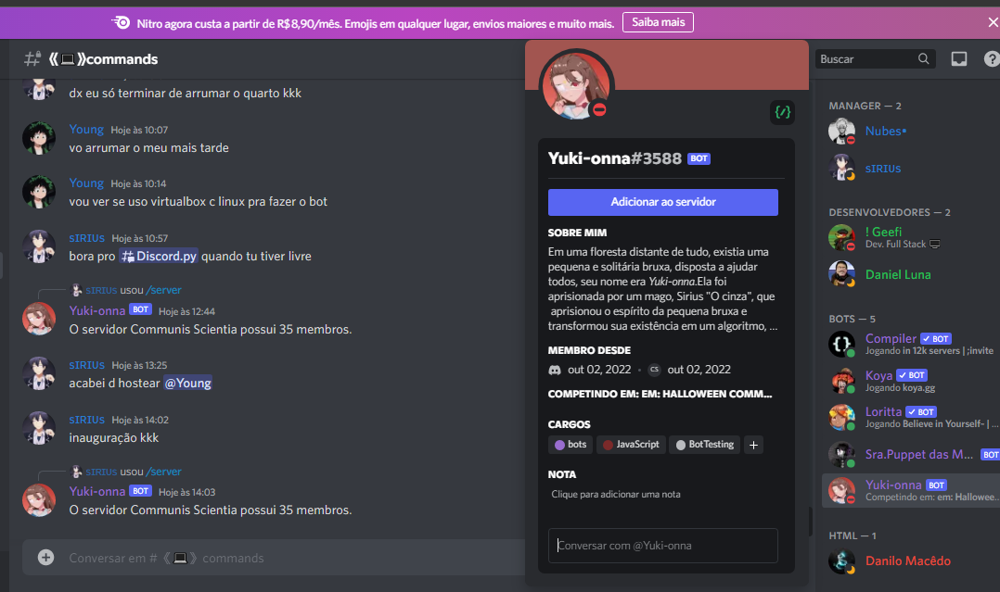

<h1 align="center">🤖 Bot em Discord.js V13</h1>

<p align="center">Um bot simples para Discord, com  lib <a href="https://discord.js.org/#/" target="_blank">[Discord.js]</a></p>

 <a href="#-tecnologias">Tecnologias</a>&nbsp;&nbsp;&nbsp;|&nbsp;&nbsp;&nbsp;
  <a href="#-projeto">Projeto</a>&nbsp;&nbsp;&nbsp;|&nbsp;&nbsp;&nbsp;
    <a href="#-dependences">Dependências</a>
</p>

<p align="center">
    
</p>


## 🚀 Tecnologias

- Javascript e JSON
- Node e npm
- Discord.js
- Git

##  💻 Projeto

O bot foi desenvolvido usando a lib Discord.js do Javascript, atualmente, possui `5 comandos`; São eles: `avatar, clear, ping, say, server e usuário`, todos em <b>Slash commands</b> ou <b>Comandos de barra</b>.

## 📚 Dependências

Instale essas dependências antes de poder usar o bot:

```
npm i discord.js

npm i colors
```
crie um arquivo : `config.json` e coloque o token do seu bot e seu `clientId`

```
{
    "token": "token-do-seu-bot",
    "clientId": "id-do-seu-bot"
}
```

Rode ```node main.js``` em seu console e aguarde a mensagem **"Estou online! E logado como ${client.user.tag}"**

<br>
<p>Lembre-se.... toda vez que criar um novo comando, dê </p>    

```node deploy-commands.js```

<br>

logo depois, reinicie o bot:

```node main.js```

## ✉️ Contato

kayquejesusdn@gmail.com